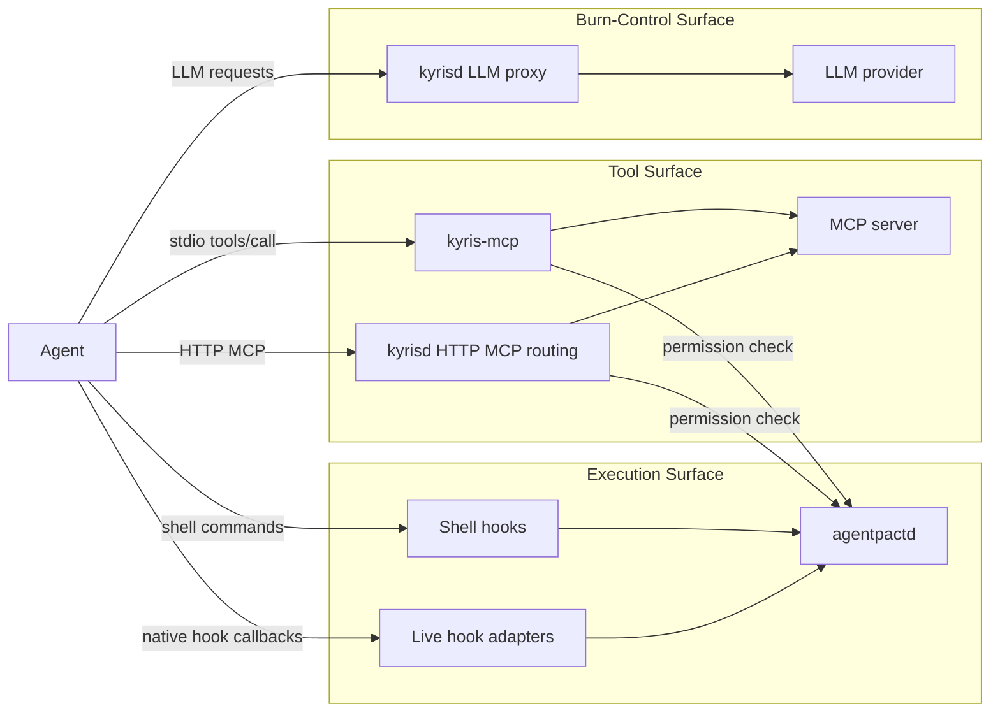
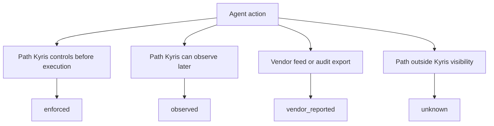
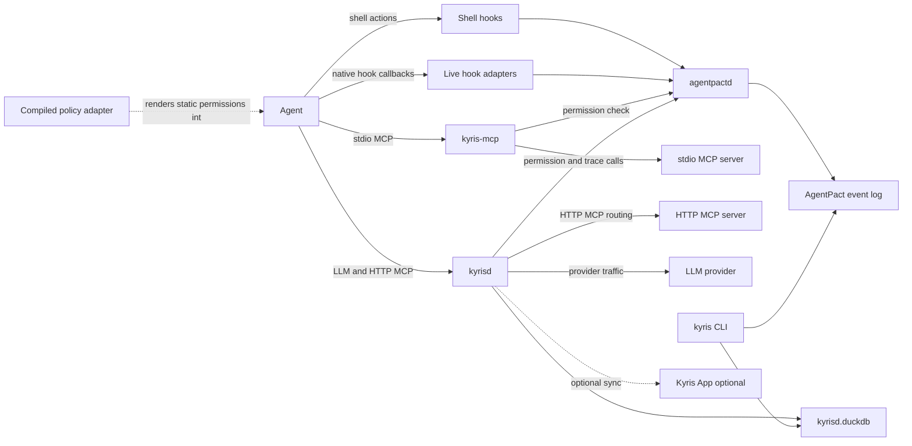
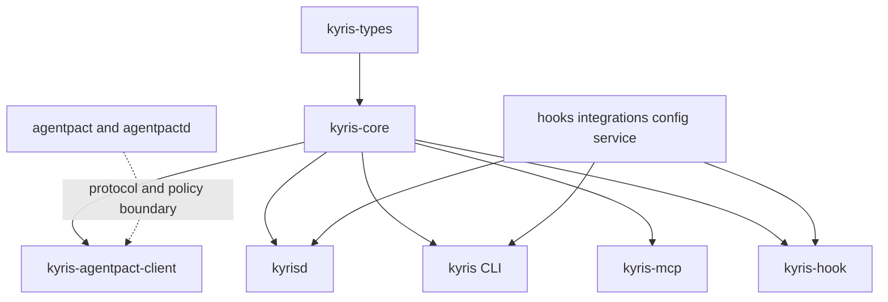
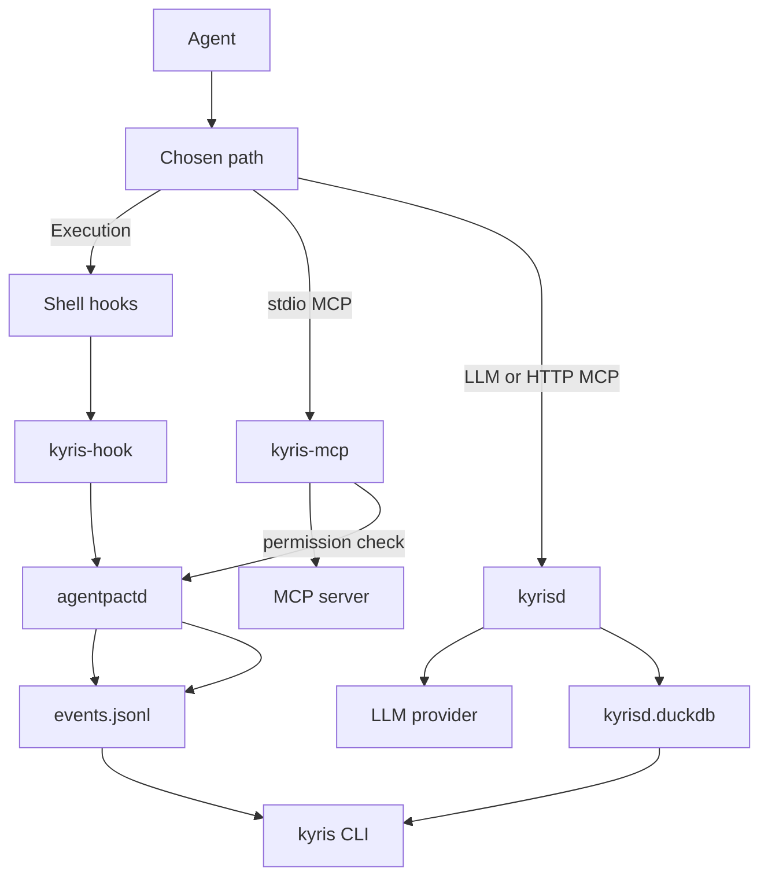

# Kyris — Local LLM Governance for AI Agents

[](https://github.com/kyr-is/kyris/actions/workflows/ci.yml) [](https://gist.github.com/vinkaga/2a8a7c5f533e65aa92dc3c0478aac964) [](LICENSE) [](https://blog.rust-lang.org/2025/02/20/Rust-1.95.0.html) [](https://github.com/kyr-is/kyris)

Kyris is the local runtime that puts agent governance on the paths you can actually reach today: shell execution, MCP tool calls, and model traffic that you explicitly route through a local gateway. It is built for developers who want more autonomy from coding agents without giving up their machine, their budget, or their ability to understand what happened after the fact.

[AgentPact](https://github.com/kyr-is/agentpact) defines the open contract: policy, protocol, event schema, attribution, and conformance. Kyris is the deployable layer around that contract: the CLI, hooks, adapters, `kyrisd`, and MCP wrapper that make the standard useful on real machines.

Today the practical target is macOS, with Apple Silicon as the primary supported path. Current support focuses on Claude Code, Gemini CLI, Codex CLI, OpenCode, and Cline through the strongest honest surface each one exposes.

## 1. Install

### 1.1 What's Included

- `kyris` CLI for install, setup, status, timeline, stats, history, replay, scan, and daemon control
- `kyrisd` local daemon binary for LLM routing, HTTP MCP routing, and local operator workflows
- `kyris-mcp` stdio MCP wrapper binary
- `kyris-hook` helper binary for shell and native hook integrations
- `launchd` service template for `kyrisd` on macOS

### 1.2 Install (user mode — currently the only shipping mode)

**Homebrew (recommended):**

```sh
brew install --cask kyr-is/tap/kyris   # auto-installs agentpact via depends_on
brew services start kyris
kyris install                          # configure shell hooks and agent integrations
```

**Install script:**

```sh
curl -fsSL https://raw.githubusercontent.com/kyr-is/kyris/main/install.sh | bash
kyris install                          # configure shell hooks and agent integrations
```

Both paths install the same four binaries (`kyris`, `kyrisd`, `kyris-mcp`, `kyris-hook`) and the same hardened `launchd` plist. The script auto-installs agentpact if it's missing (chained `curl ... | bash` of agentpact's install.sh) and auto-detects `brew` to delegate when present; pass `--no-brew` to force the script path or `--no-agentpact` to skip the dependency check. No `sudo` required. The daemon runs as the developer; state lives under `~/.kyris/`.

**Uninstall** — three levels, pick the one that matches how clean a slate you want. All three work regardless of install channel.

Run the cached installer (`~/.kyris/installer.sh`) rather than `curl … | bash` against `main`. Install cached a version-matched copy of `install.sh` exactly so uninstall uses the same code that placed the files; pulling `main` can drift if the on-disk layout has changed since you installed.

| Level | Command | What gets removed | What stays |
| --- | --- | --- | --- |
| **1. Integrations only** | `kyris uninstall` | Shell hooks (`~/.zshrc`/`~/.bashrc` edits), per-agent config edits (Claude Code `settings.json`, etc.), `~/.kyris/` runtime scaffolding | Binaries, `launchd` plist (`kyrisd` keeps running until you stop it), config (`~/.config/kyris/`), data (`~/.local/share/kyris/`), state/logs (`~/.local/state/kyris/`) |
| **2. Default uninstall** (preserves user data) | `~/.kyris/installer.sh --uninstall`<br>or `brew uninstall --cask kyr-is/tap/kyris` | Everything in Level 1 plus binaries (`kyris`, `kyrisd`, `kyris-mcp`, `kyris-hook`), `launchd` plist, `~/.kyris/`, package receipt | Config (`~/.config/kyris/kyrisd.yaml`), data (`~/.local/share/kyris/credentials.json`, `kyrisd.duckdb`), state (`~/.local/state/kyris/log/`, `fail-open.jsonl`, `approvals.jsonl`) — so a reinstall picks up where you left off |
| **3. Full wipe** (clean slate) | `~/.kyris/installer.sh --uninstall --reset-data`<br>or `brew uninstall --cask --zap kyr-is/tap/kyris` | Everything in Level 2 plus the three XDG dirs (`~/.config/kyris/`, `~/.local/share/kyris/`, `~/.local/state/kyris/`) | Nothing kyris-related |

How the script chooses: `~/.kyris/installer.sh --uninstall` runs `kyris uninstall` first (Level 1 cleanup), then either delegates to `brew uninstall --cask` if it detects a brew-managed install (adding `--zap` when `--reset-data` is passed), or removes the binaries / plist / `~/.kyris/` itself. `--reset-data` adds the XDG-dir wipe in either path. Pass `--no-brew` to force the script path when both are available.

**If `~/.kyris/installer.sh` is missing** (e.g. the runtime dir was deleted manually), fall back to:
```sh
curl -fsSL https://raw.githubusercontent.com/kyr-is/kyris/main/install.sh | bash -s -- --uninstall [--reset-data]
```
The network fallback works in practice but isn't version-matched.

**Agentpact cascade.** All three levels also remove agentpact when kyris was its last dependent. The check reads `~/.local/share/kyr-packages/*.json` — if any other manifest declares `depends_on: ["agentpact"]`, agentpact is preserved with a `leaving agentpact installed: still required by …` log line. Pass `--no-agentpact` to keep agentpact regardless. `--reset-data` / `--zap` propagates: script-installed agentpact gets `--reset-data`, brew-installed agentpact gets `--zap`, so a full kyris wipe is a full agentpact wipe too. The cascade chose this direction because new kyris versions reconcile the agentpact version on install — there's no reason to leave a stale agentpact behind.

**Mixing channels is unsupported.** If you install kyris via brew but agentpact via the script (or vice versa), dependency tracking is incomplete — brew won't refuse to uninstall a script-installed agentpact while kyris still needs it. Pick one channel per machine and stick with it.

### 1.3 Enterprise mode (planned, phase 2)

Enterprise mode will install `kyrisd` as a root `LaunchDaemon` with tamper-proof local audit logs, signed event entries, root-owned config at `/etc/kyris/`, and a shared socket at `/var/run/kyrisd.sock` — for regulated environments and MDM-managed fleets where the audit trail must survive an adversarial operator. The current `install.sh` rejects `--enterprise` with a "not yet available" message.

### 1.4 Quick Start

```sh
kyris install
kyris agents
kyris status
```

<hr>

## 2. For Users
Current agent tooling still forces a bad tradeoff. If you let the agent run with broad autonomy, you risk destructive commands, silent tool use, and runaway spend. If you keep every built-in prompt turned on, you spend the whole session babysitting. Kyris tries to remove that tradeoff by getting onto the paths where control is technically real and by being explicit about where it is not.

### 2.1 The Problem Kyris Solves
There are four recurring problems Kyris is designed to solve.

- **Unsafe autonomy.** Developers want to let agents edit files, run builds, and keep moving, but not `rm -rf`, rewrite git history, or run destructive commands without a real stop.
- **Weak vendor-specific controls.** Prompt text and agent-native permissions are inconsistent across tools and are not a portable answer for mixed-agent environments.
- **Poor forensic visibility.** When something breaks, the developer usually has to reconstruct the session from chat logs, terminal output, and git state.
- **Runaway burn.** Cost visibility and hard spend controls are only honest when Kyris is actually on the request path.

The goal is not "all-seeing governance." The goal is a local runtime that makes the reachable surfaces safer, clearer, and more useful than the status quo.

### 2.2 The Three Control Surfaces
Kyris uses three surfaces as its organizing model.

| Surface | What it governs | How Kyris gets in | What the user gets |
| --- | --- | --- | --- |
| **Execution surface** | Shell commands and environment-changing actions | Shell hooks and live agent hook adapters talk to the AgentPact daemon | Preventive allow / ask / deny before risky local actions run |
| **Tool surface** | MCP tool calls | `kyris-mcp` for stdio MCP or `kyrisd` for HTTP MCP | Policy checks and auditable tool use on reachable MCP paths |
| **Burn-control surface** | LLM usage, routing, and token breaker behavior | The agent points its provider base URL at `kyrisd` | Metered usage, local cost records, and token circuit breaking on routed traffic |



### 2.3 How Kyris Fits Into The Local Stack
Kyris is not one binary pretending to solve everything. The local stack has two layers: the AgentPact daemon, which comes from the `agentpact` project, and the Kyris-owned components in this repo that sit on top of it. Those Kyris components do not all have the same long-term role: some are enduring product surfaces, while others are explicit bridges for today's non-native agents.

| Component | What it does | Problem it solves | Long-term role in an AgentPact-native world |
| --- | --- | --- | --- |
| **AgentPact daemon (`agentpactd`)** | Evaluates policy, issues decisions, writes the standard event log, and defines the open permission protocol | Gives every governed action a portable policy and audit model | **Foundational.** A compliant agent still needs an AgentPact runtime or equivalent daemon behavior |
| **Shell hooks** | Put the AgentPact decision path in front of shell commands | Stops destructive shell actions before they run | **Long-term complementary layer.** The architecture docs are explicit that native integrations do not replace shell hooks; they remain defense in depth for anything that reaches the shell |
| **Live native hook adapters** | Bridge an agent's native hook system to the AgentPact daemon on each action | Covers agent-specific actions that never touch the shell | **Bridge for today's agent surfaces.** Less central when an agent exposes native AgentPact mediation directly, but still useful until that path is real |
| **Compiled policy adapters** | Render a bounded slice of AgentPact policy into agent-native permission config | Gives some protection for agents that expose static config but no live hook | **Compatibility bridge, not the destination.** The architecture treats these as degraded defense in depth, not a substitute for live daemon mediation |
| **`kyrisd`** | Kyris daemon for LLM routing, HTTP MCP routing, local storage, and sync | Gets Kyris onto the burn-control and HTTP MCP paths | **Long-term product daemon.** Right now its spend records are the primary local spend signal because most agents do not yet emit native AgentPact usage events; in an AgentPact-native future the daemon log becomes primary and `kyrisd` becomes routing plus convenience cache / cross-reference rather than the primary source of spend truth |
| **`kyris-mcp`** | Wraps stdio MCP servers and checks `tools/call` against policy | Governs stdio MCP where launch-command interception is the reachable surface | **Long-term tool-surface component for stdio MCP.** It remains the Kyris path for local stdio MCP governance wherever wrapping the server command is still the real interception point |
| **`kyris` CLI** | Install, setup, status, timeline, history, replay, stats, scan, daemon control | Makes the system deployable and explainable to an actual developer | **Long-term product surface.** Local evidence queries, timeline, scan, install, and enroll stay in Kyris even when the open contract lives in AgentPact |

The distinction is straightforward. Compiled adapters are compatibility bridges for agents that do not expose a better live path yet, and `kyrisd`'s current spend records are a temporary bridge until agents emit native AgentPact usage events. Shell hooks, `kyrisd` as a product daemon, `kyris-mcp`, and the `kyris` CLI are the longer-lived Kyris surfaces that sit above the AgentPact contract rather than trying to replace it.

### 2.4 How You Actually Use Kyris
The normal workflow is simple. Exact output depends on what is installed and what the agent just did, but it should look roughly like this.

1. Install the binaries with Homebrew or the install script.

   Example response from the install script:

   ```text
   [kyris] kyris installer
   [kyris] Fetching latest release...
   [kyris] Downloading kyris v0.1.0 for aarch64-apple-darwin...
   [kyris] Installed binaries to /Users/alex/.local/bin
   [kyris] Installation complete!
   ```

2. Run `kyris install` to set up shell hooks, binaries, and agent integrations.

   Example response:

   ```text
   Kyris Installer
   ===============
   Installed hooks:
     - updated ~/.zshrc
     - updated ~/.bashrc
   Installed claude-code:
     - wrote /Users/alex/.claude/hooks/agentpact_pretooluse.sh

   Component status:
   Missing components:
     agentpactd - Install separately via AgentPact's own installer.
   ```

3. Run `kyris agents setup <agent>` for the agents you use, or `kyris agents` to see what Kyris detected.

   Example response:

   ```text
   $ kyris agents
   Agent         Execution        Tool             Burn-Control     Status
   claude-code   adapted(hook)    adapted(hook)    none             ok
   codex-cli     none             none             none             ok
   cline         none             none             none             ok

   $ kyris agents setup claude-code
   Applied setup for claude-code:
     wrote /Users/alex/.kyris/env/load.sh
     wrote /Users/alex/.kyris/env/claude-code.sh
     updated ~/.zshrc
   ```

4. Point supported LLM traffic at `kyrisd` if you want real burn control on that path.

   Example result for routed agents:

   ```sh
   # ~/.kyris/env/claude-code.sh
   export ANTHROPIC_BASE_URL=http://127.0.0.1:4710
   export ANTHROPIC_API_KEY=sk-kyris-inbound

   # ~/.kyris/env/codex-cli.sh
   export OPENAI_BASE_URL=http://127.0.0.1:4710/v1
   export OPENAI_API_KEY=sk-kyris-inbound
   ```

5. Work normally, then use the query commands when you want to inspect what happened.

   Example response:

   ```text
   2026-04-25T15:03:11Z  claude-code     execute    denied   [enforced] git push --force origin main
   2026-04-25T15:03:17Z  anthropic       think      ok       [observed] claude-4-sonnet-20250301  [1820→412]  $0.0214  [local]
   2026-04-25T15:03:22Z  claude-code     write      auto     [enforced] kyris/README.md
   ```

The most useful commands for day-to-day use are:

- `kyris status`

  Example response:

  ```text
  Kyris Status
  ============
    [+] agentpactd (/Users/alex/.agentpact/agentpact.sock)
    [+] kyrisd (launchd, http://127.0.0.1:4710/healthz)
    [+] shell hooks
    [+] claude-code live hook
    [-] codex-cli live hook
    [-] gemini-cli live hook
    [-] cline compiled policy
    [-] enrolled
    [+] component versions aligned (kyris=0.1.0, kyrisd=0.1.0, agentpactd=0.1.0)
  ```

- `kyris timeline`

  Example response:

  ```text
  2026-04-25T15:03:11Z  claude-code     execute    denied   [enforced] git push --force origin main
  2026-04-25T15:03:17Z  anthropic       think      ok       [observed] claude-4-sonnet-20250301  [1820→412]  $0.0214  [local]
  2026-04-25T15:03:22Z  claude-code     write      auto     [enforced] kyris/README.md
  ```

- `kyris stats`

  Example response:

  ```text
  Actions by decision:
    execute    denied   1
    write      auto     7

  Coverage breakdown:
    enforced         8
    observed         3

  Token usage:
    anthropic        3 requests        5420 in         980 out

  Spend:
    anthropic    claude-4-sonnet-20250301      $  0.2143  (3 requests)
  ```

- `kyris history`

  Example response:

  ```text
  2026-04-25T15:03:22Z  claude-code     write      auto     kyris/README.md
  2026-04-25T15:03:11Z  claude-code     execute    denied   git push --force origin main
  ```

- `kyris replay <session>`

  Example response:

  ```text
  2026-04-25T15:03:05Z  claude-code     execute    approved [enforced] cargo test  mode=ask
  2026-04-25T15:03:11Z  claude-code     execute    denied   [enforced] git push --force origin main  mode=deny

  Gateway records:
    2026-04-25T15:03:17Z  anthropic    claude-4-sonnet-20250301    ok        842ms  [1820→412]  $0.0214

  3 events replayed.
  ```

Two points are worth being explicit about.

- **Everything is independently installable.** You can use Kyris just for shell governance, just for routed LLM traffic, just for MCP wrapping, or as a combined local stack.
- **Kyris only claims control on paths it actually owns.** If your agent bypasses `kyrisd`, you do not get a Kyris token breaker on that path. If an MCP call never passes through `kyris-mcp` or `kyrisd`, Kyris does not pretend it governed it.

### 2.5 Burn Control, Timeline, And Reports
Kyris is meant to replace a messy reconstruction workflow. Without it, you piece the story together from chat history, terminal scrollback, vendor dashboards, and guesswork. With it, you use one local interface to answer the two questions people ask after every serious agent run: "What happened?" and "What did it cost?"

- `kyris timeline` is the fast answer when you want the full picture: commands, approvals, tool calls, model usage, and coverage in one human-readable stream.
- `kyris stats` is the burn-control view: where tokens went, which models were active, how decisions broke down, and what Kyris could actually see.
- `kyris history` is the searchable view when you want to filter by agent, action, decision, or time range.
- `kyris replay <session>` is the forensic view when you want one session reconstructed in order.

If you enroll the machine, in-scope records can also sync to the hosted Kyris product. The local CLI still works without enrollment, and the open-source value proposition should stand on its own even if you never sync anything.

### 2.6 Coverage Honesty
Coverage terms describe what Kyris actually saw and controlled. If Kyris does not own the path, it does not claim to control the path.

| Coverage state | What it means | Typical example |
| --- | --- | --- |
| **`enforced`** | Kyris intercepted the action and applied policy before execution | Shell command stopped by hooks, MCP call checked before execution |
| **`observed`** | Kyris saw the action or its direct side effects, but not as a guaranteed preventive gate | Routed LLM request recorded by `kyrisd` without a stronger pre-execution claim on downstream effects |
| **`vendor_reported`** | Kyris learned about the action from a vendor feed rather than a local preventive path | Vendor audit or analytics feed |
| **`unknown`** | Kyris had no trustworthy visibility into the path | Ungoverned traffic that bypassed Kyris entirely |



That honesty matters because it keeps the tool trustworthy. Kyris is strongest when it is boringly clear about what it really intercepted, what it only observed, and what it never saw at all.

<hr>

## 3. For Developers
This repo contains the open deployable tools in the Kyris stack. It does not contain the AgentPact standard itself, and it does not contain Kyris's hosted services. The code here exists to get onto reachable local surfaces, make the AgentPact daemon useful, and turn local events plus routed model traffic into something a developer can actually inspect.

### 3.1 Architecture At A Glance
The architecture is intentionally split into three buckets.

| Bucket | What it owns | Why the split exists |
| --- | --- | --- |
| **AgentPact** | The open standard, daemon semantics, policy format, protocol, event schema, and conformance model | Keeps governance portable and not tied to one product implementation |
| **Kyris OSS** | The local runtime and developer tooling in this repo | Gets onto reachable surfaces, produces local value, and makes the standard deployable |
| **Kyris Proprietary** | Hosted governance system, evidence graph, and organization-level operations | Covers live ops, sync, approvals, and enterprise workflows that do not belong in a repo-local standard |

The main architectural boundary is one-way dependency: Kyris depends on AgentPact; AgentPact must not depend on Kyris.

That is why a machine can legitimately run two daemons: `agentpactd` as the standard daemon and `kyrisd` as the Kyris product daemon.



### 3.2 Repo Layout
This repo is deliberately kept small. It separates pure types, shared local logic, binaries, and install-time assets so contributors can reason about boundaries quickly.

| Path | Purpose | Notes |
| --- | --- | --- |
| `types/` | `kyris-types`: pure schema and serialization types | No I/O, no DuckDB, no sockets, no runtime concerns |
| `core/` | `kyris-core`: shared local helpers | Re-exports `kyris-types` and adds config loading plus AgentPact wire helpers |
| `agentpact-client/` | UDS client for `agentpactd` | Keeps daemon communication logic out of the binaries |
| `daemon/` | `kyrisd` | LLM routing, HTTP MCP routing, local storage, sync, tray, notifications |
| `cli/` | `kyris` | Installer, setup, query commands, scan, status, lifecycle commands |
| `mcp/` | `kyris-mcp` | Minimal stdio MCP wrapper for governed `tools/call` paths |
| `hooks/helper/` | `kyris-hook` | Tiny helper binary for the shell-hook protocol boundary (check, respond, send). Native agent hooks use `kyris hook check` instead. |
| `hooks/` | Zsh and Bash hook scripts | Transport glue only; shell scripts do not own JSON protocol logic |
| `integrations/` | Agent-specific integration assets | Compiled policy template for Cline. Live hook scripts are generated at runtime by `hook_script_source()` in `cli/src/agents/configure.rs`. |
| `config/` | Runtime defaults and examples | Includes `default.yaml`, `example.yaml`, and pricing data |
| `service/` | Service definitions | Currently the `launchd` plist for `kyrisd` |



### 3.3 Runtime Flows
The runtime has three main flows, one per reachable surface.

- **Execution flow.** Shell hooks pass actions to `kyris-hook` (fast, synchronous). Live native hook adapters use `kyris hook check` (full CLI binary with hold-poll-resolve for `PACT_ASK`). Both talk to `agentpactd` and return allow / deny results in the format the caller expects.
- **Tool flow.** `kyris-mcp` interposes on stdio MCP `tools/call`; `kyrisd` interposes on HTTP MCP. Both use AgentPact policy decisions rather than inventing a second policy model.
- **Burn-control flow.** `kyrisd` accepts provider-native requests, forwards them upstream in the same provider format, meters the result, enriches it with local cost data, and stores it in DuckDB.

The local evidence loop is the key product shape: preventive decisions go into the AgentPact event log, routed gateway records go into DuckDB, and the CLI reads both.



### 3.4 Design Decisions That Matter
Several decisions are intentional enough that contributors should treat them as constraints, not suggestions.

- **No per-project Kyris config.** Project-specific policy belongs in AgentPact's directory walk-up tree. `kyrisd.yaml` is machine-wide.
- **No provider normalization layer.** `kyrisd` uses native-format passthrough for provider adapters. Shared infra is metering, circuit breaking, auth, and storage, not request translation.
- **Shell scripts stay thin.** `kyris-hook` owns the shell-to-daemon protocol boundary so the scripts remain transport glue. Native agent hooks use `kyris hook check` in the full CLI binary for the hold-poll-resolve pattern that `PACT_ASK` requires.
- **Coverage claims are path-based.** If Kyris is not on the path, the right answer is `observed`, `vendor_reported`, or `unknown`, not wishful thinking.
- **`kyris-types` is a stability boundary.** Pure shared types stay separate so local crates and future hosted systems can share a contract without dragging in runtime dependencies.
- **`kyris-mcp` stays intentionally minimal.** Stdout is reserved for JSON-RPC, so the wrapper avoids database, web stack, and heavy observability dependencies on purpose.

### 3.5 Current Scope And Extension Points
Kyris is deliberately narrow today: macOS-first developer tooling, not a universal governance platform pretending to be finished.

The current extension points line up with that scope.

| Area | Current shape | Where you extend it |
| --- | --- | --- |
| Provider routing | Anthropic, OpenAI, and Google passthrough adapters in `kyrisd` | `daemon/src/adapter/` |
| Live agent hooks | Claude Code, Codex CLI, Gemini CLI | `cli/src/agents/configure.rs` (`hook_script_source()`) and `cli/src/hook_cmd.rs` |
| Compiled policy | Cline, OpenCode, Codex CLI permission rendering | `cli/src/compile_policy.rs` and `integrations/compiled-policy/cline/` (template) |
| Query and reporting UX | Timeline, history, replay, stats, scan, status | `cli/src/` |
| Local runtime packaging | Config templates, service definitions, install flow | `config/`, `service/`, `install.sh` |

What should not happen in a contribution here is just as important.

- Do not add a second project-scoped configuration system.
- Do not smuggle in a provider translation layer under the name of an adapter.
- Do not make blanket burn-control claims for traffic Kyris does not own.
- Do not turn AgentPact policy into a Kyris-only policy dialect.

### 3.6 Testing And Further Reading
Tests live with the crates they exercise rather than under one monolithic top-level test directory. If you are changing behavior, start with the crate that owns that surface.

The standard local checks are:

```sh
cargo fmt --check
cargo clippy --all-targets -- -D warnings
cargo test
cargo deny check
cargo bench -p kyrisd -- --test
```

If you need more implementation context, read these next.

1. [AgentPact README](https://github.com/kyr-is/agentpact/blob/main/README.md) for the open standard boundary.
2. [`AGENTS.md`](AGENTS.md) for build, test, workspace, and runtime-path conventions in this repo.
3. [`CONTRIBUTING.md`](CONTRIBUTING.md) for contribution workflow and project expectations.

The short version is simple: AgentPact defines the contract, Kyris gets onto the path, and the code in this repo should stay honest about the difference.

<hr>

## Appendix: CLI Reference

### Lifecycle

| Command | Description |
|---------|-------------|
| `kyris install` | Install shell hooks, binaries, and configure detected agents |
| `kyris uninstall` | Remove all Kyris modifications (restores backups) |
| `kyris update [--check]` | Update Kyris binaries. `--check` prints available update without applying |
| `kyris enroll [--force] [--relay-url URL]` | Enroll machine with Kyris hosted service via GitHub device flow. `--force` re-authenticates |
| `kyris verify [--post-install] [--post-uninstall] [--json]` | Verify installation state |
| `kyris version` | Print version |

### Agent Management

| Command | Description |
|---------|-------------|
| `kyris agents` | Summary of all agents (reconciles first) |
| `kyris agents <agent>` | Detail view for one agent |
| `kyris agents status [agent]` | Show agent integration status |
| `kyris agents setup <agent> [--set KEY=VALUE...]` | Configure one agent. `--set` passes agent-specific settings (e.g. `--set maxSessionTurns=100`) |
| `kyris agents setup --auto` | Detect installed agents and configure each |
| `kyris agents reconcile [agent] [--auto]` | Detect reinstalls, repair config. `--auto` debounces (shell startup) |
| `kyris agents undo <agent>` | Remove all Kyris integrations for an agent |

### Query & Inspection

| Command | Description |
|---------|-------------|
| `kyris status` | Show component health: daemons, hooks, agents, enrollment |
| `kyris timeline [--last N]` | Unified event stream (default last 20) |
| `kyris history [--agent X] [--action X] [--decision X] [--since T] [--until T] [--dir D] [--sync-state S]` | Filtered event search |
| `kyris stats [--since DURATION]` | Burn-control summary: tokens, spend, decisions (default 7d) |
| `kyris replay <session>` | Reconstruct one session in order |

### Policy & Security

| Command | Description |
|---------|-------------|
| `kyris check <command>` | Test a command against current policy (returns allow/deny) |
| `kyris compile-policy --agent <agent> [--policy PATH]` | Render AgentPact policy into agent-native permission format |
| `kyris always list` | Show active "always" overrides across `commands.local.yaml` and `mcp.local.yaml` (kind, selector, created_at, file path) |
| `kyris always revoke <selector>` | Revoke a named override (command, path, or `server:tool` for MCP) |
| `kyris always revoke --last` | Revoke the most recently created override across all override files |
| `kyris scan run [--format terminal\|json\|html] [-o FILE] [--scanners X,Y]` | Security scan: running agents, exposed keys, MCP configs, traffic |
| `kyris scan patterns list` | List available scan patterns |

### Daemon Control

| Command | Description |
|---------|-------------|
| `kyris daemon start` | Start kyrisd |
| `kyris daemon stop` | Stop kyrisd |
| `kyris daemon status` | Show kyrisd process state |
| `kyris daemon logs` | Tail kyrisd logs |

### Operator Workflows

| Command | Description |
|---------|-------------|
| `kyris pending` | List pending approval requests (PACT_ASK decisions awaiting resolution) |
| `kyris continue <session>` | Resume/resolve a held session |

### Internal (used by hooks, not user-facing)

| Command | Description |
|---------|-------------|
| `kyris hook check --agent <agent>` | Native agent hook adapter — reads hook payload from stdin, round-trips to agentpactd |
| `kyris mcp wrap [--server NAME] <cmd> [args...]` | Wrap a stdio MCP server with policy enforcement |
