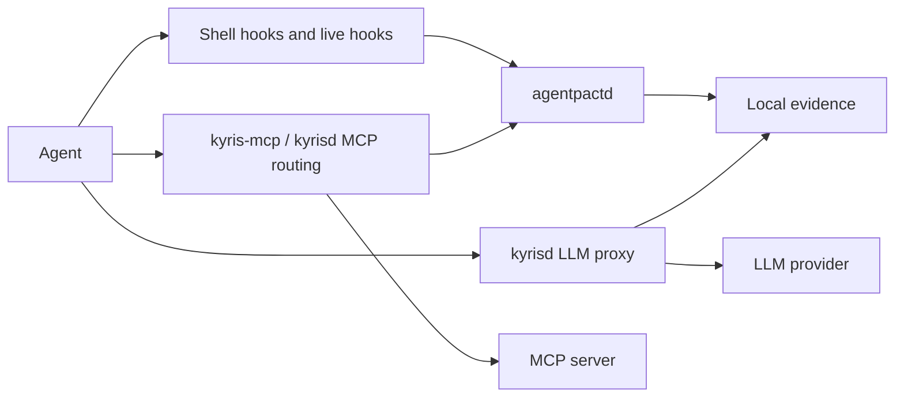

<!-- SPDX-License-Identifier: Apache-2.0 -->
<!-- DRAFT restructure of README.md — for review, not yet in place. -->

# Kyris

[](https://github.com/kyr-is/kyris/actions/workflows/ci.yml) [](https://gist.github.com/vinkaga/2a8a7c5f533e65aa92dc3c0478aac964) [](LICENSE) [](https://blog.rust-lang.org/2025/02/20/Rust-1.95.0.html) [](https://github.com/kyr-is/kyris)

AI coding agents are at their best when they can run builds, edit files, chase down errors, and keep moving. That same autonomy is a control problem: one agent rewrites your git history, another quietly calls a tool you didn't expect, a third burns through your model budget overnight — and every agent has its own permission model, its own audit trail (or none).

Kyris is a local runtime that gives you **one operating model across them**:

- **Govern shell commands** before they run — stop a destructive delete or a history rewrite at the point of execution, not after.
- **Govern MCP tool calls** that never touch a shell, whether the server is stdio or HTTP.
- **Prompt you with one consistent approval** when an action needs a decision — approve once, remember for the session, or deny — instead of learning each agent's own permission UI.
- **Pause a runaway model loop** for your continue-or-stop call, on traffic routed through the local gateway.
- **Meter and cap model spend** on gateway traffic, with per-agent and per-model accounting.
- **Keep one local record** of what happened and what it cost — governance decisions and model usage joined into a single timeline you can replay, trace, and total.
- **Stay honest about coverage** — Kyris reports what it actually governed, per path, and never claims control it didn't have.

All of this works **locally, with no account and no network**. Enroll when you want to sync that record to a web dashboard across your machines.

Kyris is built on [AgentPact](https://github.com/kyr-is/agentpact), the open governance contract — policy, protocol, event schema, attribution, conformance. AgentPact defines the standard; Kyris is the deployable local layer (CLI, hooks, adapters, `kyrisd`, MCP wrapper) that gets it onto real developer machines.

## Contents

**Guide** — install and operate Kyris

1. [What Kyris Installs](#1-what-kyris-installs)
2. [Today's Scope (Phase 1)](#2-todays-scope-phase-1)
3. [Installing, Upgrading, and Uninstalling](#3-installing-upgrading-and-uninstalling)
4. [Operating Kyris](#4-operating-kyris)
   - [4.1 Governing Shell Commands](#41-governing-shell-commands)
   - [4.2 Governing MCP Tools](#42-governing-mcp-tools)
   - [4.3 Approvals](#43-approvals)
   - [4.4 Stopping Runaway Loops](#44-stopping-runaway-loops)
   - [4.5 Tracking and Controlling Model Spend](#45-tracking-and-controlling-model-spend)
   - [4.6 Seeing What Happened](#46-seeing-what-happened)
   - [4.7 Tuning Policy](#47-tuning-policy)
   - [4.8 Syncing to a Dashboard](#48-syncing-to-a-dashboard)
5. [Agent Support](#5-agent-support)
6. [Command Reference](#6-command-reference)

**Design** — how Kyris works, and how to build on it

7. [How Kyris Works](#7-how-kyris-works)
8. [Architecture and Extension](#8-architecture-and-extension)

---

# Guide

*Install and operate Kyris.*

## 1. What Kyris Installs

Kyris installs five local binaries:

| Binary | Purpose |
| --- | --- |
| `kyris` | CLI for install, agent setup, status, activity inspection, policy control, diagnostics, and lifecycle tasks. |
| `kyrisd` | Local daemon for model routing, HTTP MCP routing, local storage, approvals, notifications, and sync. |
| `kyris-mcp` | Stdio MCP wrapper that checks tool calls against policy. |
| `kyris-hook` | Lightweight helper used by shell hooks. |
| `kyris-exec` | Sandbox launcher used for OS-backed workspace confinement. |

It also installs shell hook assets, agent integration assets, default config, and a macOS `launchd` service template for `kyrisd`.

## 2. Today's Scope (Phase 1)

Kyris runs on macOS (Apple Silicon) today — a Phase 1 scope, not where Kyris stops. It is designed as a cross-platform local runtime, with the platform-specific pieces (service management, shell mediation, process inspection) kept behind clear seams so Windows and Linux can follow. We are going deep on one platform first rather than shallow on three.

A few details are platform-specific today:

- macOS uses `launchd` for the local daemon.
- Shell mediation depends on your shell and the agent's execution path.
- Windows and Linux would integrate through their own native service, process, and shell points.

Phase 1 governs five agents — Claude Code, Cline, OpenCode, Codex CLI, and Gemini CLI — each through the strongest honest surface it exposes. The supported set grows as agents expose governable surfaces; new agents land as that work is done, not as a roadmap promise.

## 3. Installing, Upgrading, and Uninstalling

### 3.1 Homebrew (Recommended)

```sh
brew install --cask kyr-is/tap/kyris
brew services start kyris
kyris install
kyris agent setup --all
kyris status
```

The cask installs the Kyris binaries and the service definition; `kyris install` configures shell hooks and detected agent integrations, and `kyris agent setup --all` wires up every detected agent. A healthy `kyris status` reports the local daemon, AgentPact connection, shell hooks, and configured agent surfaces — and everything works from here with no account (enrollment is optional, covered in [§4.8](#48-syncing-to-a-dashboard)).

### 3.2 Install Script

```sh
curl -fsSL https://raw.githubusercontent.com/kyr-is/kyris/main/install.sh | bash
kyris install
```

Useful when Homebrew is unavailable. It installs the same binaries and prepares the same local runtime layout. Pick one channel and stay on it — mixing Homebrew and script installs on one machine is unsupported, because dependency tracking and uninstall differ.

### 3.3 Upgrading

Use the channel you installed with — `brew upgrade --cask kyr-is/tap/kyris`, or rerun the install script.

### 3.4 Uninstalling

```sh
kyris uninstall                                  # remove agent + shell integration only
~/.kyris/installer.sh --uninstall                # normal uninstall, preserves your data
~/.kyris/installer.sh --uninstall --reset-data   # clean slate, removes data too
```

(Homebrew equivalents: `brew uninstall --cask kyr-is/tap/kyris`, and `--zap` for the clean slate.) A normal uninstall preserves config, credentials, logs, and the local event store under the XDG directories so a reinstall picks up where you left off; the reset/zap path removes them.

## 4. Operating Kyris

Kyris is modular — use one surface or the whole local stack. Each capability below is what it does, how you use it, and a line on how it works.

### 4.1 Governing Shell Commands

`kyris install` adds a Kyris hook to your shell startup (zsh and bash) so an agent's commands are checked against AgentPact policy **before they run** — the most direct way to stop a destructive delete or a history rewrite. Kyris analyzes the actual command, not a prefix, so it sees through compound commands (`a && b`) and wrappers, and decides per segment.

It governs **the agent's commands, not your own typing.** The hook activates only when the shell is inside a governed agent's process tree (detected from the agent's markers or a short parent-process walk) and skips the shell's own startup files, so your interactive terminal is untouched. When a command is checked:

- **allow** → it runs (and is recorded).
- **ask** → you're prompted — on the terminal if the agent left one free, otherwise via the desktop popup ([§4.3](#43-approvals)).
- **deny** → it's blocked, with a reason.

If the daemon is ever unreachable, the behavior is explicit and visible — Kyris records the command to a fail-open spool and either allows or blocks per your `on_daemon_unavailable` setting, never a silent pass ([§7.3](#73-graceful-degradation)).

Test a decision without running anything:

```sh
kyris policy check 'git push --force origin main'
```

### 4.2 Governing MCP Tools

MCP tool calls often never touch a shell, so Kyris governs them on two paths.

**Stdio servers** — wrap the launch command with `kyris-mcp` in your MCP client's config:

```jsonc
// before:  "command": "my-mcp-server", "args": ["--arg", "value"]
"command": "kyris-mcp",
"args": ["wrap", "--server", "my-server", "--", "my-mcp-server", "--arg", "value"]
```

`kyris agent setup` rewrites supported agents' MCP configs this way for you.

**HTTP servers** — route through `kyrisd` by enabling MCP routing and registering the upstream in `kyrisd.yaml`:

```yaml
mcp:
  enabled: true
  servers:
    - name: my-server
      upstream: https://my-mcp-host/mcp
```

Either way, Kyris checks each reachable `tools/call` against policy — a `delete_file` or `drop_table` tool can be `ask` or `deny` — and records it.

### 4.3 Approvals

When a governed action resolves to **ask**, Kyris surfaces the approval itself — a desktop prompt (plus tray and app) where you **approve once**, **approve for the rest of the session**, or **deny** — and routes your answer back to the pending action. You get the same approval experience across every agent, instead of each agent's own permission model.

"Approve for the session" is remembered only for **that agent's session** and cleared when the session ends or policy changes — it doesn't silently persist or carry across agents. And for an agent with its own native prompt, Kyris can hand the decision back to it if Kyris's own path is unavailable, so a down daemon never silently lets an action through.

```sh
kyris activity approvals   # review recent approval decisions
```

### 4.4 Stopping Runaway Loops

When an agent's model traffic runs through `kyrisd`, Kyris meters the model's **output tokens since its last action**. A tool, shell, or MCP call resets that meter to zero — a working agent never approaches the cap; only a no-action generation loop does. When the count crosses the cap, `kyrisd` **gates the next request and asks you: continue or stop?** It does not auto-kill the agent — you answer on the terminal, or from the desktop popup when the agent owns it, and either answer resets the meter. Streaming responses get a stop event so the agent unwinds cleanly. This applies only to traffic routed through the gateway.

Defaults, in `kyrisd.yaml`:

```yaml
circuit_breaker:
  enabled: true
  max_tokens: 200000                # no-action output tokens before gating
  decision_timeout_seconds: 604800  # hold up to 7 days for a human, then stop
```

The hold is deliberately long: the agent should wait for a person, not receive a confusing automatic error — the timeout is only a backstop so a never-answered prompt can't pin a connection forever.

### 4.5 Tracking and Controlling Model Spend

Spend tracking and the runaway gate both need an agent's provider traffic to pass through `kyrisd`. `kyris agent setup` wires that up — pointing the agent's provider base URL (or provider config) at the local gateway (`127.0.0.1:4710`), which forwards to the real provider **with your own credential** (Kyris stores no provider key of its own). The exact mechanism per agent is in [§5](#5-agent-support).

On that path Kyris meters each request, computes spend from a pricing table it fetches from the relay (no enrollment needed), attaches a trace id, and attributes usage per agent and model — distinguishing **plan-included** from **billable overage** so the numbers reflect what you actually pay.

Set thresholds to be warned before a surprise — a desktop alert fires when the rolling total crosses each:

```yaml
spend:
  warn_thresholds_usd: [10, 50, 100]
  window_hours: 24   # rolling window (default 24h)
```

Kyris only claims burn-control for traffic that passes through `kyrisd`. If an agent talks directly to a provider, Kyris does not pretend it governed that traffic.

<!-- Embedded into kyris-app /docs/install via ReadmeSection — keep this heading text stable. -->
### 4.6 Seeing What Happened

Kyris keeps **two local evidence streams** — AgentPact governance events (commands, decisions, attribution, coverage) and `kyrisd` gateway records (provider, model, tokens, cost) — in a local store at `~/.local/share/kyris/kyrisd.duckdb`, and joins them, exactly once, into a single **timeline** correlated by **session** and model-call **trace id**. (Default retention is 7 days; tune `stats.retention_days`.)

```sh
kyris status                      # posture + component health
kyris activity                    # the unified event stream
kyris activity stats              # token, spend, and decision summaries
kyris activity replay <session>   # reconstruct a session in order
kyris activity trace <trace_id>   # records sharing one model-call trace
```

Each `activity` row shows the agent, the command or model call, the decision and coverage, and — for model calls — tokens and cost; `stats` totals spend by provider and model and breaks decisions down by agent. One coherent record across governance *and* spend, all on your machine — no chat-transcript archaeology.

### 4.7 Tuning Policy

Kyris uses **AgentPact policy** rather than inventing a Kyris-only language — `allow` / `ask` / `deny` are AgentPact decisions, and Kyris presents the operator UX around them.

- **Check** a command before trusting it: `kyris policy check '<command>'` — shows the decision and the rule behind it.
- **Enable / disable** enforcement: `kyris policy enable` enforces; `kyris policy disable` keeps recording but stops prompting or denying (log-only).
- **What the decisions mean**: `allow` runs silently (still recorded); `ask` pauses for your approval; `deny` blocks with a reason.
- **Where policy lives**: nearest wins, walked up from your working directory — project `./.agentpact/policy/*.yaml`, then user `~/.config/agentpact/policy/*.yaml`, then bundled defaults.

A policy file is small AgentPact YAML — for example, always confirm a force-push:

```yaml
apiVersion: agentpact/v1
kind: PolicyOverride
metadata:
  name: project-overrides
spec:
  commands:
    "git·push·--force": ask
```

See the [AgentPact policy reference](https://github.com/kyr-is/agentpact) for the full format. `kyris policy compile --agent <agent>` renders a bounded slice into an agent's native config when that improves coverage.

### 4.8 Syncing to a Dashboard

By default Kyris is **fully standalone** — governance, prompting, the runaway gate, activity, pricing, and spend all work with **no account and no network**. `kyris enroll` connects the runtime to the hosted Kyris relay (a GitHub sign-in mints a per-machine token) and turns on **event sync**, so you can see your activity and spend in a **web dashboard** and aggregate it across your machines.

```sh
kyris enroll
```

**Which directories' activity leaves your machine.** Sync covers the **governed directories you actually worked in**, and deliberately excludes ones that are conventionally private: hidden / dot-prefixed directories, owner-only (`0700`) directories, and the macOS personal folders are **always** excluded. With the default empty `sync.scope`, every other governed directory syncs; set `sync.scope` to a list of roots to **narrow** it to just those:

```yaml
sync:
  scope:
    - ~/work/acme       # sync activity only under these roots
    - ~/work/widgets
```

**What syncs from those directories** is a bounded summary, not raw content: per row, the agent, action type and a short detail (command line / model / path / tool name), the decision and coverage, the **working directory and git remote**, session/trace ids, and — for model calls — provider, model, token counts, cost, and status. It does **not** include your prompts, tool-call argument payloads, file contents, or any API keys (those stay in the local secret store; `kyrisd` forwards your credential and stores none). Sync goes over HTTPS, authenticated by the per-machine token. The relay stores those rows under your account **and reads them** to render your dashboard — it is the hosted service, not a zero-knowledge store, so treat anything you sync as visible to Kyris (only the machine token itself is encrypted at rest; the timeline rows are not). Kyris is one-user-per-org today — no team-sharing surface. Enrollment is opt-in and additive: unenrolled, you lose nothing locally.

## 5. Agent Support

Each agent exposes different control points, so Kyris reports coverage per surface and stays honest about the gaps.

| Agent | Execution Surface | MCP / Tool Surface | Model Routing / Burn Control | Setup Command | Notes |
| --- | --- | --- | --- | --- | --- |
| Claude Code | Native live hook (gates pre-exec) | Stdio wrap | Gateway via env | `kyris agent setup claude-code` | Strongest surface; decision before the command runs. |
| Cline | Live hook bridge | Stdio wrap | Provider-config rewrite → `kyrisd` | `kyris agent setup cline` | Burn control via rewritten provider config. |
| OpenCode | Hook plugin | Stdio wrap | Provider-config rewrite → `kyrisd` | `kyris agent setup opencode` | Plugin-based live mediation. |
| Codex CLI | Live hook + compiled policy | Stdio wrap | `kyrisd` as model provider | `kyris agent setup codex-cli` | Compiled policy complements the live hook. |
| Gemini CLI | Live hook + compiled policy | Stdio wrap | Gateway via env (**API-key mode only**) | `kyris agent setup gemini-cli` | OAuth / Code-Assist traffic can't be proxied — an honest gap. |

```sh
kyris agent                 # supported agents + integration status
kyris agent status <agent>  # detail for one agent
kyris agent setup --all     # configure every detected agent
kyris agent disconnect <agent>   # remove Kyris integration cleanly
```

Setup is **reversible**: Kyris records the structural edits it makes and `disconnect` restores your agent config semantically, so trying Kyris never traps you.

<!-- Embedded into kyris-app /docs/install via ReadmeSection — keep this heading text stable. -->
## 6. Command Reference

Run `kyris --help` (or `kyris <command> --help`) for the full surface; this is the common set.

| Command | Description |
| --- | --- |
| `kyris install` / `kyris uninstall [--reset-data]` | Configure or remove Kyris-managed local integration. |
| `kyris update [--check]` | Update or check for updates. |
| `kyris enroll [--force] [--relay-url URL]` | Enroll with the hosted Kyris service to enable sync. |
| `kyris agent` / `kyris agent status [agent]` | Show supported agents and integration status. |
| `kyris agent setup <agent> \| --all` / `kyris agent disconnect <agent>` | Configure or cleanly remove an integration. |
| `kyris status` | Posture and component health. |
| `kyris activity [stats \| replay <session> \| trace <id> \| approvals]` | Inspect the unified local record. |
| `kyris policy check <command>` / `enable` / `disable` / `compile --agent <agent>` | Test and control policy. |
| `kyris doctor` / `kyris logs` / `kyris debug <verify \| audit \| trace-on \| trace-off>` | Diagnostics. |

Hook-internal commands (`kyris hook check`, `kyris mcp wrap`) are invoked by installed hooks, not by hand.

---

# Design

*How Kyris works, and how to build on it.*

<!-- Embedded into kyris-app /docs/install via ReadmeSection — keep this heading text stable. -->
## 7. How Kyris Works

Kyris is organized around three control surfaces, all evaluated against AgentPact policy and recorded as local evidence.

| Surface | What It Governs | How Kyris Gets In |
| --- | --- | --- |
| Execution | Shell commands and environment-changing actions | Shell hooks and live agent hook adapters talk to AgentPact. |
| Tool | MCP tool calls | `kyris-mcp` wraps stdio MCP; `kyrisd` routes HTTP MCP. |
| Model | LLM usage, routing, token accounting, spend, and the runaway gate | Agents point provider base URLs or provider config at `kyrisd`. |



**The decision lifecycle.** When an agent runs a shell command, the shell hook hands it to `kyris-hook`, which asks `agentpactd` over a local socket. `agentpactd` attributes the caller, resolves policy from the directory tree, extracts the command's effects, and returns `allow` / `ask` / `deny`; the hook enforces that answer — running, prompting you, or blocking — and `agentpactd` writes the event. A **model call** follows the model path instead: the request reaches `kyrisd`, which meters tokens, applies the runaway gate, forwards to the provider with your credential, and records the call. The CLI later joins those governance events and gateway records into the timeline you read. Nothing is re-evaluated at read time — the decision happened once, on the path.

### 7.1 Coverage Is Path-Based

If Kyris is on the path **before** execution, the action can be `enforced`. If Kyris only sees a record **after** the fact, it is `observed` or `vendor_reported`. If Kyris never sees the path, coverage is `unknown`. Kyris never reports preventive control it didn't have — that honesty is the point.

### 7.2 Attribution

Per-agent policy and audit are only useful if events name the right agent. AgentPact attributes each action from validated local peer credentials and process lineage — not from self-reported environment variables an agent could spoof — falling back to `unknown` when it genuinely can't tell.

### 7.3 Graceful Degradation

When the decision path is unavailable, Kyris does not silently fail open. A shell hook spools to `~/.local/state/kyris/fail-open.jsonl` and surfaces a degraded posture; a backstopped agent defers to its own native prompt. The invariant is visibility — you always know when governance was partial.

### 7.4 Workspace Boundary and Sandbox

Kyris treats the directory an agent is launched from as that session's permitted work domain. Inside it the agent moves quickly; outside it, writes and destructive actions require an explicit decision or are denied. That boundary is what makes *fewer* prompts possible — routine edits can be allowed with confidence when surprising writes can't escape the project. On platforms with an OS sandbox backend (macOS Seatbelt today), Kyris can additionally confine the agent process tree at the kernel boundary.

### 7.5 Component Map

| Component | Role |
| --- | --- |
| `agentpactd` | Evaluates policy, issues decisions, writes standard governance events. From the AgentPact project. |
| Shell hooks | Put local command execution on the AgentPact decision path. |
| Live hook adapters | Bridge each agent's native hook system into AgentPact. |
| Compiled policy adapters | Render a bounded slice of AgentPact policy into agent-native config when useful. |
| `kyrisd` | Local daemon: provider routing, HTTP MCP routing, local storage, approvals, notifications, sync, and the runaway gate. |
| `kyris-mcp` | Minimal stdio MCP wrapper for governed MCP calls. |
| `kyris` CLI | The operator surface for setup, status, activity, policy, diagnostics, and lifecycle. |

AgentPact is the contract; Kyris is the local runtime that gets that contract onto real paths.

## 8. Architecture and Extension

This repo contains the open, deployable local tools in the Kyris stack — not the AgentPact standard itself, and not the hosted Kyris services.

### 8.1 Workspace Layout

`kyris-types` (shared types), `kyris-core` (config, paths, coverage, AgentPact helpers), `kyris-agentpact-client` (UDS client), `kyrisd` (daemon), `kyris` (CLI), `kyris-mcp` (stdio wrapper), `kyris-hook` (shell helper), plus `hooks/`, `integrations/`, `config/`, `service/`, and `xtask/`. The authoritative crate-by-crate map and runtime paths live in [AGENTS.md](AGENTS.md).

### 8.2 Key Flows

- **Install / setup**: `install.sh` or Homebrew place binaries; `kyris install` and `kyris agent setup` configure hooks and agent files.
- **Execution mediation**: shell hooks call `kyris-hook`; native agent hooks call `kyris hook check`; both route decisions through AgentPact.
- **MCP mediation**: stdio via `kyris-mcp`; HTTP via `kyrisd`.
- **Model routing**: provider-native traffic passes through `kyrisd` to the provider, metered and gated on the way.
- **Evidence**: `kyrisd` joins AgentPact events and gateway records into the timeline the CLI renders.
- **Sync**: `kyrisd` ships joined timeline rows to the relay when enrolled.

### 8.3 Extension Points

| Area | Where to Work |
| --- | --- |
| Agent support | `cli/src/agents/registry.rs`, `cli/src/agents/<agent>.rs` |
| Live hook behavior | `cli/src/hook_cmd.rs`, `cli/src/agents/` |
| Compiled policy | `cli/src/compile_policy.rs` |
| Provider routing and the gate | `daemon/src/` adapter, metering, gate, server modules |
| MCP wrapping | `mcp/src/`, `daemon/src/` HTTP MCP routing |
| Activity and status UX | `cli/src/activity.rs`, `cli/src/status.rs` |
| Config schema | `types/src/config.rs`, `core/src/config.rs`, `config/` |

### 8.4 Sources of Truth

This README is a guide, not a spec. For deeper context, see [AgentPact](https://github.com/kyr-is/agentpact) (the open governance contract Kyris builds on), [AGENTS.md](AGENTS.md) (engineering rules plus crate and path facts), and [CONTRIBUTING.md](CONTRIBUTING.md) (contribution mechanics). When docs lag code, treat the current code and tests as the source of truth.

---

## Further Reading

- [CONTRIBUTING.md](CONTRIBUTING.md) — development workflow and contribution mechanics.
- [AGENTS.md](AGENTS.md) — repository rules, crate descriptions, runtime paths.
- [SECURITY.md](SECURITY.md) — reporting security issues.
- [AgentPact](https://github.com/kyr-is/agentpact) — the open governance contract.
